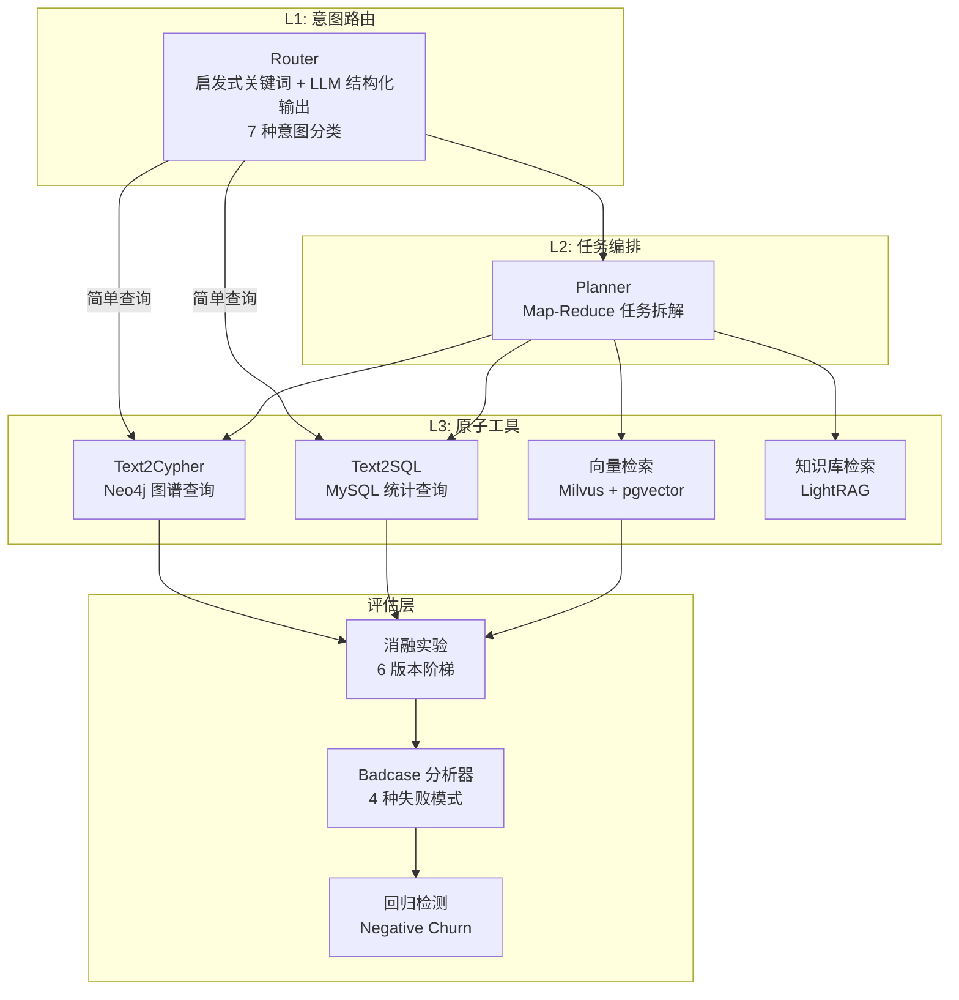
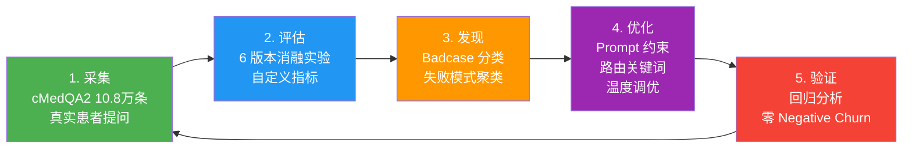

# MedAgentQA

> 基于 10.8 万条真实患者提问（cMedQA2）的医疗多 Agent 问答系统，通过消融实验和数据闭环驱动系统迭代优化。

---

## 架构



## 数据闭环



## 消融实验结果

基于 cMedQA2 真实患者提问，采用"独立对照 + 最优路径叠加"混合设计：

| 指标 | v0 (Baseline) | v3 (路由关键词) | v4 (严格约束) | vFinal (组合) |
|------|:---:|:---:|:---:|:---:|
| 医疗安全率 | 20.0% | 26.7% (+6.7) | **86.7%** (+66.7) | 60.0% (+40.0) |
| 结构化回答率 | 0.0% | 0.0% | **100%** (+100) | 93.3% (+93.3) |
| 科室建议率 | 26.7% | 26.7% | **93.3%** (+66.6) | 46.7% (+20.0) |
| 无诊断断言率 | 100% | 100% | 80.0% (-20) | **100%** (恢复) |
| 图谱路由率 | 26.7% | **40.0%** (+13.3) | 26.7% | 40.0% (+13.3) |

**关键发现**：
- v4（严格 RAG 约束）是单项贡献最大的优化：安全率 +66.7pp
- v3（路由关键词）贡献完全独立：仅影响路由率，证明 Router 与下游工具解耦良好
- v4 单独使用时无诊断断言率下降到 80%，但 vFinal 组合后恢复到 100%（协同效应）
- **Negative Churn：0 个回归，8 个修复，回归通过率 100%**

详细分析见 [docs/EVALUATION_RESULTS.md](docs/EVALUATION_RESULTS.md) 和 [docs/ABLATION_STUDY_DESIGN.md](docs/ABLATION_STUDY_DESIGN.md)

## 快速开始

```bash
# 克隆仓库
git clone https://github.com/go99further/MedAgentQA.git
cd MedAgentQA

# 配置环境
cp .env.example .env
# 编辑 .env 填入你的 API Key

# 安装依赖
pip install -r requirements.txt  # 或手动安装: ragas datasets langchain openai pandas tqdm

# 运行消融实验（15 条样本，约 25 分钟）
python scripts/run_full_ablation.py --n-samples 15

# 计算指标（零 API 成本，纯本地计算）
python scripts/compute_metrics.py

# 运行 Badcase 分析
python scripts/run_badcase_analysis.py
```

## 项目结构

```
MedAgentQA/
├── data/
│   ├── eval/                              # 评估数据（核心资产）
│   │   ├── ablation_results.json          # 消融实验原始问答数据
│   │   ├── ablation_comparison.md         # 消融对比表格
│   │   ├── badcase_report.json            # 失败模式与回归分析
│   │   ├── metrics_report.json            # 指标计算结果
│   │   ├── eval_set_500.jsonl             # 500 条分层抽样评估池
│   │   └── text2sql_test_set.jsonl        # 50 条 Text2SQL 测试用例
│   ├── cmedqa2/                           # cMedQA2 数据集（需自行下载）
│   ├── medical_kg/
│   │   └── neo4j_schema.cypher            # 医疗知识图谱 Schema
│   └── init_mysql.sql                     # 医疗数据库（50疾病/200症状/100药物）
├── docs/
│   ├── EVALUATION_RESULTS.md              # 完整评估报告
│   ├── ABLATION_STUDY_DESIGN.md           # 消融实验设计说明
│   └── DATA_FLYWHEEL.md                   # 数据闭环方法论
├── evaluation/                            # 评估框架
│   ├── ragas_eval.py                      # RAGAS 集成（扩展点）
│   ├── badcase_analyzer.py                # Badcase 分类（RAGAS 格式，扩展点）
│   └── custom_metrics.py                  # 自定义指标
├── medagent/                              # Agent 核心代码
│   ├── application/agents/
│   │   ├── lg_builder.py                  # 主路由 + LangGraph 编排
│   │   ├── lg_prompts.py                  # 医疗领域提示词（10 个）
│   │   ├── lg_states.py                   # 路由状态定义
│   │   ├── text2sql/                      # Text2SQL 工作流（7 步流水线）
│   │   └── kg_sub_graph/                  # 知识图谱子图 + 多工具编排
│   ├── infrastructure/knowledge/
│   │   ├── knowledge_service.py           # 向量检索服务
│   │   ├── reranker.py                    # 多供应商 Rerank
│   │   └── vector_store.py                # Milvus 向量存储
│   └── application/services/
│       └── redis_cache.py                 # Redis 语义缓存
├── scripts/
│   ├── run_full_ablation.py               # 消融实验运行器（6 版本）
│   ├── compute_metrics.py                 # 独立指标计算（零 API 成本）
│   ├── run_badcase_analysis.py            # Badcase 分析入口
│   ├── sample_eval_set.py                 # 评估集抽样
│   └── ingest_cmedqa2.py                  # cMedQA2 数据导入
├── .env.example
└── README.md
```

## 技术栈

LangGraph / LangChain / Milvus / Neo4j / MySQL / PostgreSQL(pgvector) / Redis / RAGAS

## License

MIT
