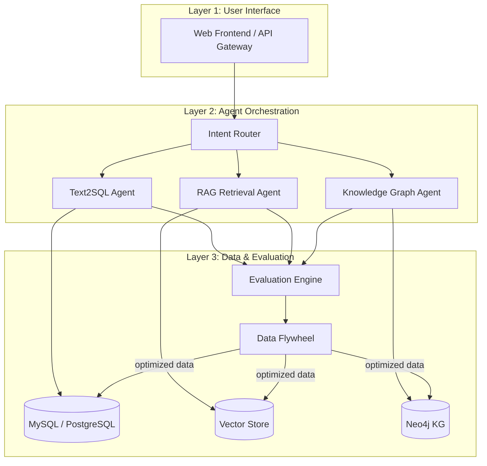
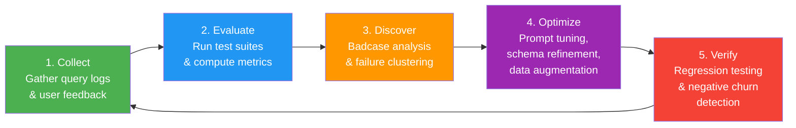

# MedAgentQA

> A data-flywheel-driven evaluation framework for medical question-answering agents, combining Text2SQL, RAG retrieval, and knowledge graph reasoning into a unified benchmarking pipeline.

---

## Architecture



## Data Flywheel



## Key Features

- **Multi-Agent Architecture** -- Unified orchestration of Text2SQL, RAG, and Knowledge Graph agents with intelligent intent routing
- **Comprehensive Evaluation** -- 50+ curated test cases spanning 7 SQL types and 3 difficulty levels, with execution accuracy (EX) and exact match (EM) metrics
- **Data Flywheel Pipeline** -- Automated 5-step cycle (Collect, Evaluate, Discover, Optimize, Verify) that continuously improves system quality
- **Badcase Analysis** -- Structured failure taxonomy covering SQL generation errors, retrieval misses, schema mismatches, and reasoning failures
- **Negative Churn Detection** -- Ensures new optimizations do not regress previously correct answers
- **Medical Knowledge Graph** -- Neo4j-backed graph with diseases, symptoms, departments, drugs, and their relationships
- **Docker-Ready Deployment** -- Full Docker Compose stack for one-command local development and evaluation

## Evaluation Results

| Metric | Baseline | + Flywheel Round 1 | + Flywheel Round 2 | + Flywheel Round 3 |
|--------|----------|--------------------|--------------------|---------------------|
| Text2SQL EX (Easy) | -- | -- | -- | -- |
| Text2SQL EX (Medium) | -- | -- | -- | -- |
| Text2SQL EX (Hard) | -- | -- | -- | -- |
| Text2SQL EX (Overall) | -- | -- | -- | -- |
| RAG Recall@5 | -- | -- | -- | -- |
| RAG MRR | -- | -- | -- | -- |
| KG F1 | -- | -- | -- | -- |
| Negative Churn Rate | -- | -- | -- | -- |

## Quick Start

### Prerequisites

- Docker & Docker Compose
- Python 3.10+
- OpenAI or compatible API key

### Launch

```bash
# Clone the repository
git clone https://github.com/your-org/MedAgentQA.git
cd MedAgentQA

# Configure environment
cp .env.example .env
# Edit .env to set your API keys and database credentials

# Start all services
docker compose up -d

# Run the evaluation pipeline
python scripts/run_eval.py --test-set data/eval/text2sql_test_set.jsonl --output results/

# View results
python scripts/report.py --input results/
```

### Manual Setup (without Docker)

```bash
# Create virtual environment
python -m venv .venv
source .venv/bin/activate  # Linux/Mac
# .venv\Scripts\activate   # Windows

# Install dependencies
pip install -r requirements.txt

# Initialize database
python scripts/init_db.py

# Import knowledge graph
python scripts/import_kg.py

# Run evaluation
python scripts/run_eval.py --test-set data/eval/text2sql_test_set.jsonl
```

## Project Structure

```
MedAgentQA/
├── data/
│   ├── eval/
│   │   └── text2sql_test_set.jsonl    # Text2SQL evaluation test cases
│   ├── cmedqa2/                        # Chinese medical QA dataset
│   ├── medical_kg/                     # Knowledge graph source data
│   └── neo4j/                          # Neo4j import files
├── docs/
│   └── DATA_FLYWHEEL.md               # Data flywheel methodology
├── evaluation/
│   ├── text2sql_evaluator.py           # SQL execution accuracy scorer
│   ├── rag_evaluator.py                # RAG retrieval metrics
│   ├── kg_evaluator.py                 # Knowledge graph F1 scorer
│   └── churn_detector.py              # Negative churn detection
├── medagent/
│   ├── agents/
│   │   ├── text2sql_agent.py           # Text2SQL generation agent
│   │   ├── rag_agent.py                # RAG retrieval agent
│   │   └── kg_agent.py                 # Knowledge graph reasoning agent
│   ├── router.py                       # Intent routing logic
│   └── orchestrator.py                 # Multi-agent orchestration
├── scripts/
│   ├── run_eval.py                     # Evaluation pipeline entry point
│   ├── init_db.py                      # Database initialization
│   ├── import_kg.py                    # Knowledge graph import
│   └── report.py                       # Results reporting
├── web/                                # Frontend application
├── docker-compose.yml
├── requirements.txt
├── .env.example
└── README.md
```

## Citation

```bibtex
@misc{medagentqa2025,
  title={MedAgentQA: A Data-Flywheel-Driven Evaluation Framework for Medical QA Agents},
  author={MedAgentQA Contributors},
  year={2025},
  url={https://github.com/your-org/MedAgentQA}
}
```

## License

This project is licensed under the [MIT License](LICENSE).
